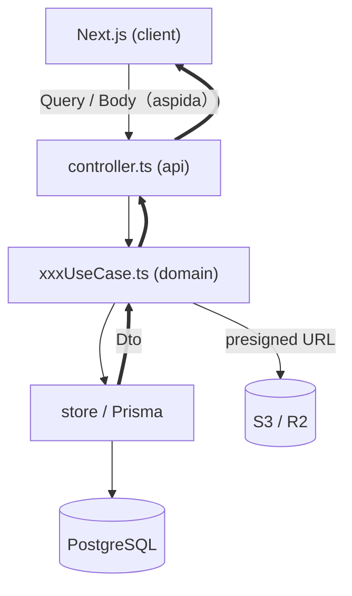

# CATAPULT

aspida + frourio による FullStack TypeScript モノレポ。

## コードを読む（Code Tour）

初めて読む人向けに、理解しやすい順番のガイド付きツアーを `.tours/` に用意しています。VS Code 拡張 [CodeTour](https://marketplace.visualstudio.com/items?itemName=vsls-contrib.codetour)（`vsls-contrib.codetour`）をインストールし、サイドバーの **CODE TOURS** から順に辿ってください。

| # | ツアー | 読む内容 |
|---|---|---|
| 1 | 全体像と読む順番 | モノレポ構成・型安全な契約・エントリポイント |
| 2 | サーバのレイヤリング | 提出フローで controller → useCase → model → store（DDD）を一気に理解 |
| 3 | クライアント: ローカルファースト基盤 (U6f) | IndexedDB 暗号化・オフライン同期 |
| 4 | クライアント: 調査ウィザード UI (U6u) | 画面ジャーニー（ウィザード・一覧・結果） |


## 技術スタック

| 領域 | 採用技術 |
|---|---|
| Frontend | Next.js (App Router) / React 18 / jotai / SWR |
| Backend | Fastify / frourio / aspida（型安全 RPC） |
| ORM / DB | Prisma + PostgreSQL |
| 認証 | AWS Cognito（`aws-amplify`） |
| ストレージ | AWS S3 または Cloudflare R2（presigned URL） |
| ローカル永続 | IndexedDB（`idb`）＋ Web Crypto（クライアント暗号化） |
| DI / テスト | velona（依存性注入）/ Vitest / fast-check（PBT） |

- 関数型アーキテクチャ・全関数に依存性注入が可能
- 3rd Party Cookie なし
- ローカル開発は Node.js + Docker Compose で完結

## アーキテクチャ

### モノレポ構成

```text
.
├── client/   # Next.js（UI・features/・app/）
├── server/   # Fastify（api/ ・ domain/ ・ service/ ・ prisma/）
└── package.json（ルート・3つの package.json を run-p/run-s で統括）
```

`client/common`・`client/api` は `server` 配下へのシンボリックリンク。型・API クライアントを共有し、aspida がエンドポイントの整合をコンパイル時に保証する。

### サーバのレイヤリング（DDD）

```text
api/{path}/controller.ts   … 入力検証(zod) + L1認可 + ルーティング（frourio）
        │
domain/{kind}/xxxUseCase.ts … ユースケース（トランザクション・監査・ポート呼出, velona DI）
        │
domain/{kind}/model/*       … 純粋なドメインロジック・ビジネスルール（L2認可）
        │
domain/{kind}/store/*       … 永続化（Prisma）/ DTO 変換
```

副作用（S3・PDF 生成・時刻など）は `service/` と velona のポートに隔離し、ドメインは純粋に保つ。

### データフロー



クライアントは入力を IndexedDB（暗号化）に保持し、提出時にサーバへ一括同期する（ローカルファースト）。

## 起動方法（ローカル開発）

### 1. 前提

- Node.js **v24 以上**
- Docker / Docker Compose

### 2. 依存インストール（package.json は3つ）

```sh
npm i
npm i --prefix client
npm i --prefix server
```

### 3. 環境変数ファイルの作成

```sh
cp client/.env.example client/.env
cp server/.env.example server/.env
```

### 4. ミドルウェア起動（PostgreSQL / Cognito エミュレータ / MinIO / Inbucket）

```sh
docker compose up -d
```

### 5. 開発サーバ起動

```sh
npm run notios
```

Web ブラウザで http://localhost:3000 を開く（ターミナル表示は [notios](https://github.com/frouriojs/notios) で制御。終了は `Ctrl + C` を2回）。

- 仮想メール（検証コード等）: http://localhost:2501 （Inbucket）
- MinIO コンソール: http://localhost:9001
- PostgreSQL UI: `cd server && npx prisma studio`

## よく使うコマンド（ルート）

```sh
npm run generate    # Prisma + frourio($server) + aspida($api) + pathpida($path) + hcm
npm run build       # client(next build) + server(esbuild)
npm test            # client / server の Vitest（server は Docker 必須）
npm run typecheck   # tsc（client / server）
npm run lint        # eslint / stylelint / prettier / prisma format
```

> server のテスト・マイグレーションは Docker Compose（PostgreSQL ほか）が稼働している前提。スキーマ反映は `npm run migrate:deploy --prefix server`。
