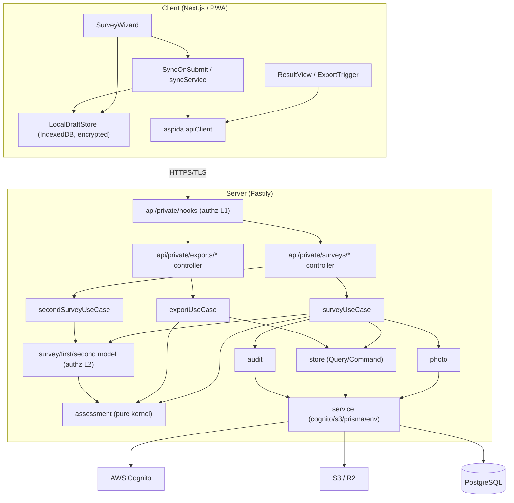

# コンポーネント依存関係・通信・データフロー（Application Design）

依存方向は内向き（`presentation → usecase → model → store/service`）。`assessment` は純粋カーネルで他に依存しない。クライアントはローカルファースト、提出時にサーバへ一括同期。

---

## 1. 依存関係図



---

## 2. 依存マトリクス（→ = 依存する）

| from \ to | auth | survey | first/second | assessment | photo | export | store | service |
|---|---|---|---|---|---|---|---|---|
| api/hooks | → | → | → | | | → | | → |
| surveyUseCase | → | → | → | → | → | | → | → |
| secondSurveyUseCase | → | → | → | → | | | → | → |
| exportUseCase | → | → | | → | | | → | → |
| survey/first/second model | → | (自) | (自) | → | | | | |
| assessment | | | | (純粋) | | | | |
| photo | | | | | (自) | | → | → |
| store | | | | | | | (自) | → |

- `assessment` は**何にも依存しない**（純粋）。逆に複数から依存される＝テスト容易性・PBT に最適（AD1=A の狙い）。
- `model` 層は `assessment`（純粋）以外の外部・他層に依存しない（DDD ガイドライン §1）。

---

## 3. 通信方式

| 区間 | 方式 | 備考 |
|---|---|---|
| Client ↔ Server | HTTP-RPC（frourio + aspida）/ TLS | 既存踏襲。Cookie idToken（HttpOnly/Secure/SameSite=strict） |
| Client → IndexedDB | ブラウザ内 API | アプリ層暗号化（Web Crypto）。PII・画像を保持 |
| SyncOnSubmit → API | `POST /api/private/surveys/submission` | 提出時一括（AD2-FU2=A）。再試行・キューイング |
| Server → PostgreSQL | Prisma（RepeatableRead tx） | 保存時暗号化（SECURITY-01） |
| Server → S3 | AWS SDK（SSE 有効） | 画像。キー `surveys/{id}/photos/{ulid}.{ext}` |
| Server → Cognito | AWS SDK（service/cognito） | 認証・ロール解決 |

---

## 4. 主要データフロー

### 4.1 オフライン入力 → 提出時同期（ローカルファースト）★
```
[offline] SurveyWizard --入力/撮影--> LocalDraftStore(IndexedDB, 暗号化)
[submit]  SyncOnSubmit --SubmissionPayload(TLS)--> api/private/surveys/submission
          --> surveyUseCase.ingestSubmission
              --> store.save(first/second) + photo.saveMany(S3)
              --> assessment.calc* + classify (純粋)
              --> 結果保存 + survey.submit + audit
          <-- 200 OK --> SyncOnSubmit --> LocalDraftStore.purgeAfterSync (PII/画像消去)
[fail]    SyncOnSubmit --enqueue--> オンライン復帰で retryPending（ローカル保持）
```

### 4.2 計算（参照系プレビュー／確定算出）
```
入力(値) --> assessment.calcFirst|calcSecond --> applyFloorRatio --> classifyDamageLevel
        --> AssessmentResult{ damageRatio, level, breakdown }
（同一入力→同一結果: 決定論的, FR-27 / PBT-04）
```

### 4.3 承認・確定・正式判定
```
管理者 --approve--> survey(提出→承認) --finalize--> (承認→確定, 不変) + audit
第1次/第2次併存 --chooseOfficial--> OfficialDetermination 保存 + audit
```

### 4.4 出力（サーバ生成, AD4=A）
```
ExportTrigger --> exportUseCase.buildSurveyPdf|Csv (認可) --> store.Query(認可範囲)
            --> assessment 整形 --> PDF/CSV(Buffer) --> ダウンロード応答
```

---

## 5. データ整合・トランザクション境界
- 1提出の登録（入力＋画像＋計算＋状態遷移＋監査）は単一 `RepeatableRead` トランザクションで原子的に処理（部分反映を防止）。S3 put 失敗時は DB ロールバックで整合確保。
- 確定済み調査は不変（FR-05）。再調査は別エンティティ（第2次, AD5=B）で履歴を残す。

## 6. 認可境界（多層, AD6=A）
- **L1**: `api/private/hooks`（認証＋ロール）。
- **L2**: Model 層 `assert*`（オブジェクト/機能、デフォルト拒否）。
- いずれの層も通過しないアクセスは拒否（fail closed, SECURITY-15）。

## 7. ローカル保持データの保護（SECURITY-01）
- IndexedDB の PII・画像はアプリ層暗号化。保持期間限定。**同期成功確認後に確実に消去**（成功前は喪失防止のため保持）。共用端末・セッション終了時の扱いは NFR Design で具体化。
