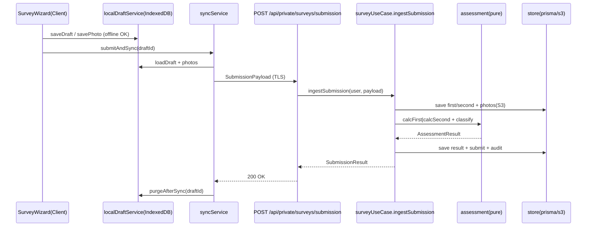

# サービス定義とオーケストレーション（Application Design）

UseCase（アプリケーションサービス）と Service 層（ACL/基盤）のオーケストレーションを定義する。既存 CATAPULT 規約: UseCase はトランザクション境界、`Query→Method→Command` を基本形、外部 I/O は Service 層経由。

---

## 1. アプリケーションサービス（UseCase）

### 1.1 `surveyUseCase`
オーケストレーション中核。状態機械と計算・永続化を統括。

| メソッド | フロー | 認可 | トランザクション |
|---|---|---|---|
| `create` | Method.create → Command.save | 調査員/管理者 | RepeatableRead |
| `ingestSubmission` ★ | 入力検証 → firstSurvey/secondSurvey 保存 → photo.saveMany(S3) → assessment 計算 → 結果保存 → survey.submit | 所有調査員 | RepeatableRead |
| `approve` | Query.findById → Method.approve → Command.save → 監査 | 管理者 | RepeatableRead |
| `finalize` | Query → Method.finalize → Command.save → 監査 | 管理者 | RepeatableRead |
| `reject`（後続） | Query → Method.reject → Command.save | 管理者 | RepeatableRead |
| `chooseOfficial` | findPairByHouse → Method.chooseOfficial → saveOfficial → 監査 | 管理者 | RepeatableRead |
| `list` / `get` | Query（認可込み） | ロール別 | 読み取り |

**`ingestSubmission` の詳細オーケストレーション**（提出時一括同期の受け口、FR-19）:
```
1. validators で SubmissionPayload を検証（PII/数値/画像メタ）
2. transaction('RepeatableRead'):
   a. survey 取得 or 作成（assertMutable）
   b. firstSurvey/secondSurvey upsert（区分に応じ分岐, AD5=B）
   c. photo.saveMany → S3 put（部位/全体紐付け）
   d. assessment.calcFirst|calcSecond + applyFloorRatio + classifyDamageLevel
   e. 結果を survey/result に保存
   f. survey.submit（下書き→提出）
   g. 監査記録（実施者・日時）
3. SubmissionResult を返す（クライアントは成功確認後にローカル purge）
```

### 1.2 `secondSurveyUseCase`
- `startReexamination`: 対象第1次の確定検証（未確定は 403/409）→ 第2次新規作成（親参照）→ save。FR-08, AC-8。

### 1.3 `exportUseCase` ★AD4=A
- `buildSurveyPdf` / `buildSurveyCsv`: 認可 → Query（認可範囲）→ assessment 結果整形 → 生成（サーバ）。生成は副作用境界。FR-31/32/33。

### 1.4 `assessmentService`（呼び出し規約）
- `assessment` は純粋関数群のため UseCase から直接呼び出す（DI 可能）。永続化・I/O を持たない。NFR-04, §7 PBT。

---

## 2. Service 層（ACL / 基盤）— 既存踏襲・拡張

### 2.1 `service/cognito`（拡張）
- 認証・ユーザー属性取得（既存）。ロール属性/グループ → `Role` 解決を追加（FR-41）。

### 2.2 `service/s3`（拡張）
- 画像 put/get/delete。キー規約 `surveys/{surveyId}/photos/{ulid}.{ext}`。一括 put（`saveMany`）に対応。保存時暗号化（SSE）を有効化（SECURITY-01）。

### 2.3 `service/prismaClient`（踏襲）
- `transaction('RepeatableRead', fn)` リトライ付きヘルパーを全 UseCase で使用。

### 2.4 `service/envValues`（踏襲）
- 環境変数を zod 検証（生 `process.env` をドメインで参照しない）。

### 2.5 監査サービス（新規 or 既存拡張）
- `auditCommand.record(tx, { actor, action, target, before?, after?, at })` — 状態遷移・PII/確定変更を改ざん困難に記録（NFR-08, SECURITY-13/14）。各 mutate UseCase から呼ぶ。

### 2.6 `export` 生成基盤
- サーバ側 PDF/CSV 生成ライブラリは NFR/Infrastructure Design で選定（候補は NFR Design）。ドメイン語彙↔ライブラリ変換は ACL として隔離。

---

## 3. クライアント側サービス（ローカルファースト）

### 3.1 `localDraftService`（IndexedDB ACL）★AD2-FU=A
- IndexedDB への暗号化読み書きを抽象化（Web Crypto によるアプリ層暗号化）。`SurveyWizard` はこのサービス経由でのみローカル永続化に触れる。SECURITY-01。

### 3.2 `syncService`（提出時同期）★AD2-FU2=A
- `submitAndSync`: Draft→`SubmissionPayload`→ aspida `apiClient.private.surveys.submission.$post` → 成功確認 → `localDraftService.purgeAfterSync`。
- 不通/失敗時は送信キューに退避し、`navigator.onLine`/`online` イベントで `retryPending`。喪失防止のため成功確認前は purge しない。FR-19, NFR-02。

### 3.3 `networkStatusService`
- オンライン/オフライン状態の監視と UI 通知、同期トリガ補助。

---

## 4. サービス間オーケストレーション図（提出時同期）



## 5. 認可の多層強制（AD6=A）
- **L1 プレゼンテーション**: `api/private/hooks` で認証＋ロール注入、機能レベルの粗いガード。
- **L2 ドメイン**: 各 Model の `assertRole` / `assertOwnerOrRole`（オブジェクトレベル、デフォルト拒否）。SECURITY-08, US-802。
