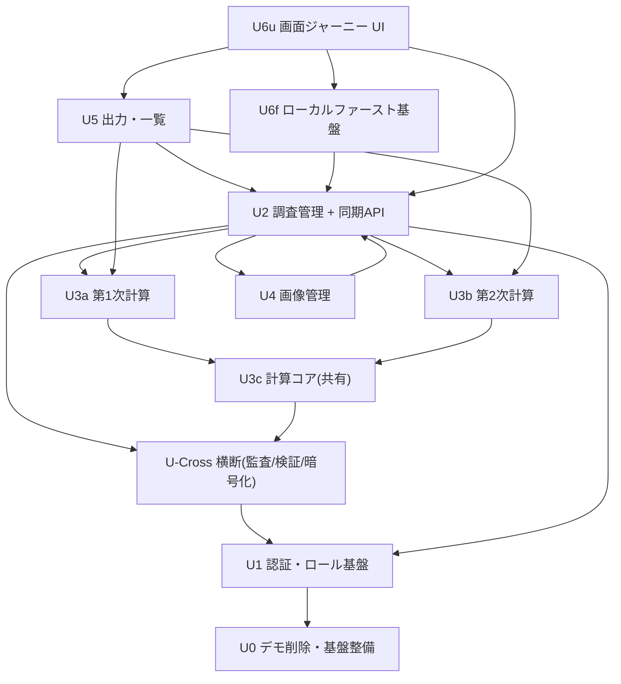

# ユニット依存マトリクス（Unit of Work Dependency）

11 ユニット間の依存関係。依存方向は内向き（プレゼンテーション/UI → ユースケース → モデル → 計算/ストア/横断基盤）。計算カーネル（U3c/U3a/U3b）は永続化・フレームワークに非依存。

---

## 1. 依存関係図

> 矢印 `A --> B` は「A が B に依存する（B を前提とする/B を利用する）」を表す。

---

## 2. 依存マトリクス（→ = 行が列に依存する）

| from \ to | U0 | U1 | U-Cross | U2 | U3c | U3a | U3b | U4 | U5 | U6f | U6u |
|---|---|---|---|---|---|---|---|---|---|---|---|
| **U0** | - | | | | | | | | | | |
| **U1** | → | - | | | | | | | | | |
| **U-Cross** | | → | - | | | | | | | | |
| **U2** | | → | → | - | | → | → | → | | | |
| **U3c** | | | → | | - | | | | | | |
| **U3a** | | | | | → | - | | | | | |
| **U3b** | | | | | → | | - | | | | |
| **U4** | | | → | → | | | | - | | | |
| **U5** | | → | → | → | | → | → | | - | | |
| **U6f** | | → | → | → | | | | | | - | |
| **U6u** | | → | | → | | | | | → | → | - |

注:
- **U3c/U3a/U3b** は `assessment` 純粋カーネル。U3c は U-Cross の型/PBT 基盤のみ参照し、ドメイン永続化には依存しない。U3a/U3b は U3c のみに依存。
- **U4** は U2（survey 集約）に紐付くが、U2 も提出時に画像保存で U4 を利用するため相互参照（実装上は同期 API の集約 UseCase が両者を統括）。
- **U-Cross** は全ユニットから利用される横断基盤（マトリクスでは主要依存のみ記載。検証/監査/暗号化は U2/U4/U5/U6f が利用）。
- **U6u** はサーバ API（U2/U5）と U6f（ローカルファースト基盤）に依存。

---

## 3. ストア/外部サービス依存（共通）

| ユニット | PostgreSQL | S3 | Cognito | IndexedDB |
|---|---|---|---|---|
| U1 | ○（user） | | ○ | |
| U-Cross | ○（audit） | | | |
| U2 | ○ | | | |
| U4 | ○（メタ） | ○ | | |
| U5 | ○（読取） | ○（読取） | | |
| U6f | | | | ○ |

---

## 4. 循環依存の確認
- 計算ユニット（U3c/U3a/U3b）への依存は一方向（消費側 → 計算）で循環なし。
- U2↔U4 の相互参照は、提出時集約 UseCase（U2 内）が画像保存（U4）をオーケストレーションする一方向の呼び出しに正規化し、実体としての循環は発生させない。
- それ以外のユニット間依存は構築順序（U0→…→U6u）と整合し、後段が前段に依存する非循環構造。
