# Execution Plan

## Detailed Analysis Summary

### Transformation Scope (Brownfield)
- **Transformation Type**: Application（既存 CATAPULT テンプレート上に新ドメインを構築）。デプロイモデル（単一 Docker コンテナー）・基盤（Next.js/Fastify/Prisma/PostgreSQL/Cognito/S3）は踏襲。
- **Primary Changes**: デモ用 Task/User ドメインを削除し、住家被害認定調査（水害）ドメインを新規構築。被害度計算エンジン、調査ワークフロー、第1次/第2次調査、画像、結果出力、ロール認可を追加。
- **Related Components**: server（domain/api/service）、client（app/features/hooks/layouts）、prisma（schema/migrations）、common（types/validators）、tests。

### Change Impact Assessment
- **User-facing changes**: Yes — 調査員/管理者/閲覧者向けの新しいタブレット UI とジャーニー。
- **Structural changes**: Yes — 新ドメイン群（DDD: UseCase/Model/Store）を追加、既存デモドメインを置換。
- **Data model changes**: Yes — Survey（調査区分・状態・親調査参照）、PII、部位別入力、判定結果、正式判定、画像、マスタ（部位・構成比・浸水深換算）。
- **API changes**: Yes — 調査 CRUD、状態遷移、第2次調査、計算、出力（PDF/CSV）、認可。
- **NFR impact**: Yes — セキュリティ・ベースライン全面適用（PII）、計算精度（PBT 全面適用）、中規模性能、タブレット UX。

### Component Relationships (Brownfield)
- **Primary Component**: server/domain（新規 survey/assessment 等）
- **Shared Components**: server/common（types/validators、client と symlink 共有）
- **Dependent Components**: client（aspida 生成 API 経由）、server/api（controllers）
- **Supporting Components**: prisma（DB）、service（cognito/s3/prisma）、tests（PBT + 統合）

### Risk Assessment
- **Risk Level**: Medium（計算結果は罹災証明の基礎となり業務的影響が大きい＝高インパクトだが、PBT・例示テスト・運用指針準拠で緩和。技術的には小さく反復可能）。PII 取扱いによりセキュリティ要件は厳格。
- **Rollback Complexity**: Easy〜Moderate（新規構築中心、テンプレート基盤は安定）。
- **Testing Complexity**: Complex（計算ロジックの境界・不変条件、ワークフロー状態機械、認可）。

## Workflow Visualization

```mermaid
flowchart TD
    Start(["User Request"])

    subgraph INCEPTION["INCEPTION PHASE"]
        WD["Workspace Detection<br/><b>COMPLETED</b>"]
        RE["Reverse Engineering<br/><b>COMPLETED</b>"]
        RA["Requirements Analysis<br/><b>COMPLETED</b>"]
        US["User Stories<br/><b>COMPLETED</b>"]
        WP["Workflow Planning<br/><b>IN PROGRESS</b>"]
        AD["Application Design<br/><b>EXECUTE</b>"]
        UG["Units Generation<br/><b>EXECUTE</b>"]
    end

    subgraph CONSTRUCTION["CONSTRUCTION PHASE"]
        FD["Functional Design<br/><b>EXECUTE</b>"]
        NFRA["NFR Requirements<br/><b>EXECUTE</b>"]
        NFRD["NFR Design<br/><b>EXECUTE</b>"]
        ID["Infrastructure Design<br/><b>EXECUTE light</b>"]
        CG["Code Generation<br/><b>EXECUTE</b>"]
        BT["Build and Test<br/><b>EXECUTE</b>"]
    end

    subgraph OPERATIONS["OPERATIONS PHASE"]
        OPS["Operations<br/><b>PLACEHOLDER</b>"]
    end

    Start --> WD
    WD --> RE
    RE --> RA
    RA --> US
    US --> WP
    WP --> AD
    AD --> UG
    UG --> FD
    FD --> NFRA
    NFRA --> NFRD
    NFRD --> ID
    ID --> CG
    CG --> BT
    BT --> OPS
    BT --> End(["Complete"])

    style WD fill:#4CAF50,stroke:#1B5E20,stroke-width:3px,color:#fff
    style RE fill:#4CAF50,stroke:#1B5E20,stroke-width:3px,color:#fff
    style RA fill:#4CAF50,stroke:#1B5E20,stroke-width:3px,color:#fff
    style US fill:#4CAF50,stroke:#1B5E20,stroke-width:3px,color:#fff
    style WP fill:#4CAF50,stroke:#1B5E20,stroke-width:3px,color:#fff
    style AD fill:#FFA726,stroke:#E65100,stroke-width:3px,stroke-dasharray: 5 5,color:#000
    style UG fill:#FFA726,stroke:#E65100,stroke-width:3px,stroke-dasharray: 5 5,color:#000
    style FD fill:#FFA726,stroke:#E65100,stroke-width:3px,stroke-dasharray: 5 5,color:#000
    style NFRA fill:#FFA726,stroke:#E65100,stroke-width:3px,stroke-dasharray: 5 5,color:#000
    style NFRD fill:#FFA726,stroke:#E65100,stroke-width:3px,stroke-dasharray: 5 5,color:#000
    style ID fill:#FFA726,stroke:#E65100,stroke-width:3px,stroke-dasharray: 5 5,color:#000
    style CG fill:#4CAF50,stroke:#1B5E20,stroke-width:3px,color:#fff
    style BT fill:#4CAF50,stroke:#1B5E20,stroke-width:3px,color:#fff
    style OPS fill:#BDBDBD,stroke:#424242,stroke-width:2px,stroke-dasharray: 5 5,color:#000
    style INCEPTION fill:#BBDEFB,stroke:#1565C0,stroke-width:3px,color:#000
    style CONSTRUCTION fill:#C8E6C9,stroke:#2E7D32,stroke-width:3px,color:#000
    style OPERATIONS fill:#FFF59D,stroke:#F57F17,stroke-width:3px,color:#000
    style Start fill:#CE93D8,stroke:#6A1B9A,stroke-width:3px,color:#000
    style End fill:#CE93D8,stroke:#6A1B9A,stroke-width:3px,color:#000

    linkStyle default stroke:#333,stroke-width:2px
```

### Text Alternative（フォールバック）
- INCEPTION: Workspace Detection（完了）→ Reverse Engineering（完了）→ Requirements Analysis（完了）→ User Stories（完了）→ Workflow Planning（実行中）→ Application Design（実行）→ Units Generation（実行）
- CONSTRUCTION: Functional Design（実行）→ NFR Requirements（実行）→ NFR Design（実行）→ Infrastructure Design（軽量実行）→ Code Generation（実行）→ Build and Test（実行）
- OPERATIONS: Operations（プレースホルダ）

## Phases to Execute

### 🔵 INCEPTION PHASE
- [x] Workspace Detection (COMPLETED)
- [x] Reverse Engineering (COMPLETED)
- [x] Requirements Analysis (COMPLETED)
- [x] User Stories (COMPLETED)
- [x] Execution Plan (IN PROGRESS)
- [ ] Application Design - **EXECUTE**
  - **Rationale**: 新コンポーネント・サービス（調査ドメイン、計算エンジン、ワークフロー、出力、認可）の特定と責務・依存の定義が必要。
- [ ] Units Generation - **EXECUTE**
  - **Rationale**: 新データモデル・API・複雑なドメインロジックを複数のユニットに分解して構築する必要がある。

### 🟢 CONSTRUCTION PHASE
- [ ] Functional Design - **EXECUTE**（per-unit）
  - **Rationale**: 計算エンジン（運用指針準拠）、状態機械、データモデルの詳細設計が必要。PBT-01（プロパティ特定）もここで実施。
- [ ] NFR Requirements - **EXECUTE**（per-unit）
  - **Rationale**: セキュリティ・ベースライン（PII）、性能（中規模）、PBT フレームワーク（fast-check）選定が必要。
- [ ] NFR Design - **EXECUTE**（per-unit）
  - **Rationale**: 認証・認可・監査ログ・暗号化・入力検証・エラー処理のパターンを設計に織り込む。
- [ ] Infrastructure Design - **EXECUTE（軽量）**（per-unit）
  - **Rationale**: デプロイは既存単一コンテナー＋マネージドサービスを踏襲。ただしセキュリティ・ベースライン（保存時/通信時暗号化・アクセスログ・ネットワーク）の posture を軽量に文書化する。IaC は未導入のため最小限。
- [ ] Code Generation - **EXECUTE**（ALWAYS）
  - **Rationale**: 実装計画とコード生成（テスト含む）。
- [ ] Build and Test - **EXECUTE**（ALWAYS）
  - **Rationale**: ビルド・単体/統合/PBT・検証。

### 🟡 OPERATIONS PHASE
- [ ] Operations - PLACEHOLDER
  - **Rationale**: 将来のデプロイ・監視ワークフロー。

## Units Decomposition（提案 — Units Generation で確定）
- **U1 認証・ユーザー/ロール基盤**: Cognito 連携、User、ロール（調査員/管理者/閲覧者）、認可基盤。
- **U2 調査管理（Survey 集約）**: 調査作成、家屋情報、PII、GPS、状態機械（下書き→提出→承認→確定）、第1次/第2次の関連・正式判定。
- **U3 被害度計算エンジン**: 第1次（外力/傾斜/浸水深）＋第2次（部位別×構成比）、損害割合→6区分、運用指針マスタ。**PBT 重点**。
- **U4 画像管理**: 撮影・S3 保存・部位/全体紐付け。
- **U5 結果出力**: PDF（調査票様式）/ CSV エクスポート、一覧・検索。
- **U6 フロントエンド（タブレット UI）**: ジャーニー画面（ログイン/作成/入力・撮影/計算確認/ワークフロー/第2次/出力）。

## Module Update Strategy (Brownfield)
- **Update Approach**: Hybrid（基盤は順次、機能ユニットは依存に従い一部並行可）。
- **Critical Path**: U1（認証・ロール）→ U2（調査）→ U3（計算）。U3 は U2 のモデルに依存。
- **Coordination Points**: server/common の型・zod バリデータ（client と共有）、frourio/aspida 生成（API 変更時に再生成）、Prisma スキーマ/マイグレーション。
- **Sequence**:
  1. デモ Task/User ドメインの削除（SECURITY-09 と整合）
  2. U1 認証・ユーザー/ロール基盤
  3. U2 調査管理（状態機械・第1次/第2次関連）
  4. U3 被害度計算エンジン（PBT）
  5. U4 画像管理
  6. U5 結果出力
  7. U6 フロントエンド（並行着手可、API 確定に追従）
- **Testing Checkpoints**: 各ユニットで単体/PBT、U2+U3 統合、最終で全体統合・E2E 相当。
- **Rollback Strategy**: ユニット単位のコミット境界。スキーマ変更はマイグレーション単位で可逆性を確保。

## Estimated Timeline
- **Total Phases (残)**: INCEPTION 2（App Design, Units）＋ CONSTRUCTION（per-unit × 6 ユニット ＋ Build/Test）。
- **Estimated Duration**: 規模相応（本計画では工数見積りは行わず、ユニット単位で段階的に進行）。

## Success Criteria
- **Primary Goal**: 水害の住家被害認定調査（第1次・第2次）を、撮影しながら入力し、運用指針準拠で被害度6区分を自動判定・出力できる。
- **Key Deliverables**: 調査ドメイン、計算エンジン（PBT 検証済み）、ワークフロー、第2次/正式判定、PDF/CSV 出力、ロール認可、タブレット UI。
- **Quality Gates**: typecheck/lint/test 全通過、PBT（境界・不変条件）成功、セキュリティ・ベースライン適合、運用指針準拠の計算妥当性。
- **Integration Testing**: 認証→調査→計算→ワークフロー→出力の一連が連携動作。
- **Operational Readiness**: ログ・監査・暗号化・エラー処理が機能（NFR/セキュリティ）。
