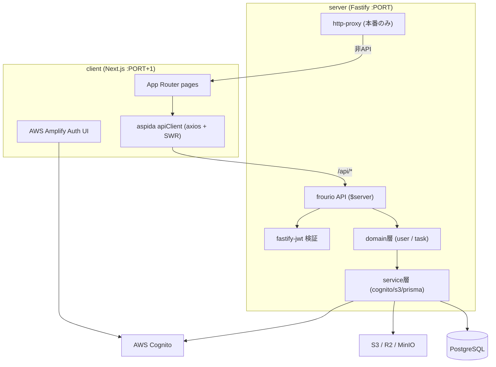
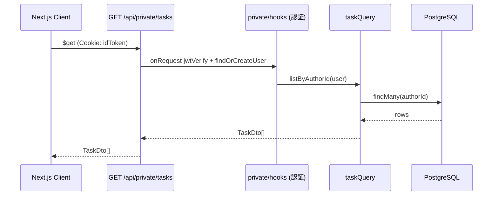
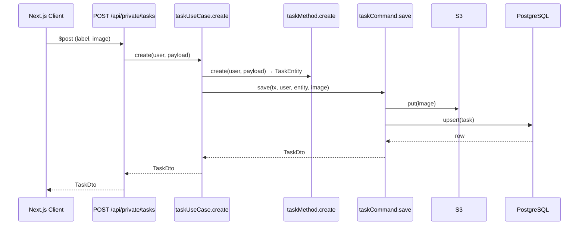

# System Architecture

## System Overview

CATAPULT は単一の Docker コンテナーでデプロイ可能な FullStack TypeScript アプリケーションです。Next.js (client) と Fastify (server) のモノレポ構成で、本番環境では Fastify が Next.js の前段に立ち、`/api` 以外のリクエストを内部の Next.js サーバーへプロキシします。型安全性は aspida（HTTPクライアント型生成）と frourio（ルーティング型生成）、Prisma（DB型生成）で端から端まで担保されます。

## Architecture Diagram

## Component Descriptions

### client
- **Purpose**: Web UI とクライアントサイド認証フロー。
- **Responsibilities**: Amplify 認証、Cookie セッション確立、タスク操作 UI、SWR データ取得。
- **Dependencies**: server の `/api`、AWS Cognito（Amplify 経由）。
- **Type**: Application (Frontend)

### server
- **Purpose**: API サーバーおよび本番時の Next.js プロキシ。
- **Responsibilities**: 認証検証、ビジネスロジック、永続化、外部サービス連携。
- **Dependencies**: PostgreSQL、Cognito、S3。
- **Type**: Application (Backend)

### server/domain
- **Purpose**: ドメインロジック（関数型 + DI）。
- **Responsibilities**: UseCase / model / store の3層でタスク・ユーザーの整合性を保つ。
- **Dependencies**: service層（prisma/cognito/s3）。
- **Type**: Application (Domain)

### server/service
- **Purpose**: 外部リソースのクライアントとアプリ初期化。
- **Responsibilities**: Fastify 構築、Prisma/Cognito/S3 クライアント、環境変数の検証 (zod)。
- **Dependencies**: AWS SDK、Prisma、Fastify プラグイン。
- **Type**: Infrastructure (Application-level)

## Data Flow

### データ取得（タスク一覧）

### データ更新（タスク作成）

## Integration Points

- **External APIs**:
  - AWS Cognito Identity Provider — 認証、ユーザー属性取得、メール検証。
- **Databases**:
  - PostgreSQL — User / Task の永続化（Prisma 経由、RepeatableRead トランザクション）。
- **Third-party Services**:
  - S3 / Cloudflare R2 / MinIO（ローカル）— タスク添付画像のオブジェクトストレージ。
  - Inbucket（ローカル）— 仮想メール受信（検証コード）。
  - magnito（ローカル）— Cognito エミュレータ。

## Infrastructure Components

- **CDK Stacks**: なし（IaC は未使用）。
- **Deployment Model**: 単一 Dockerfile（node:20-alpine）。`npm run build` 後 `npm start` で client/server を同時起動。本番は Fastify が Next.js を内部プロキシ。
- **Networking**: 単一プロセス/コンテナー。Fastify が外部公開ポート、Next.js は `PORT+1` で内部待受。
- **Local Dev (compose.yml)**: magnito(5050-5052), inbucket(2500/2501), minio(9000/9001), postgres(5432)。
