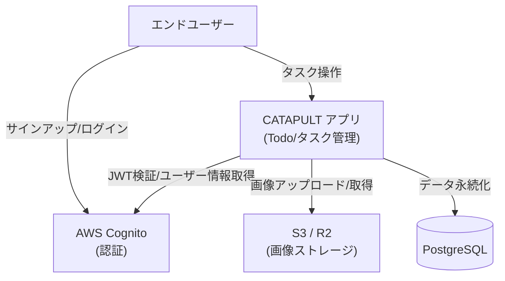

# Business Overview

## Business Context Diagram

## Business Description

- **Business Description**: CATAPULT は、aspida と frourio を用いた FullStack TypeScript テンプレートアプリケーションです。デモアプリとして「画像付きのタスク（Todo）管理」機能を提供します。ユーザーは AWS Cognito で認証し、自分専用のタスクを作成・完了切替・削除でき、各タスクに画像を添付できます。本質的にはモダンな型安全 FullStack 構成（関数型アーキテクチャ + 依存性注入 + RESTではないHTTP-RPC）のリファレンス実装です。

- **Business Transactions**:
  - **アカウント作成 / ログイン**: Cognito 経由でサインアップ・サインイン。検証コードはローカルでは Inbucket に届く。
  - **セッション確立**: クライアントが取得した idToken / accessToken を HttpOnly Cookie に保存（3rd Party Cookie なし）。
  - **ユーザー初回登録 (findOrCreate)**: 認証済みリクエスト時、DB にユーザーが存在しなければ Cognito 属性から自動生成。
  - **メールアドレス確認 (confirmEmail)**: 検証コードで Cognito 上のメール属性を確定し、DB に反映。
  - **タスク一覧取得**: ログインユーザーが所有するタスクを作成日時降順で取得。
  - **タスク作成**: ラベル（1〜20文字）と任意の画像を指定して作成。画像は S3 に保存。
  - **タスク完了状態の更新**: done フラグの切替。
  - **タスク削除**: タスクと添付画像（S3）を削除。
  - **ヘルスチェック**: DB / S3 / Cognito の死活確認。

- **Business Dictionary**:
  - **Task（タスク）**: ユーザーが管理する Todo 項目。ラベル、完了状態、任意の添付画像を持つ。
  - **User（ユーザー）**: Cognito で認証されたアカウント。表示名・サインイン名・メール・任意の写真URLを持つ。
  - **Author（作成者）**: タスクを所有するユーザー。タスクの操作は作成者本人のみ許可。
  - **Entity / Dto**: ドメイン内部表現が Entity、API/層間で受け渡す表現が Dto。Branded ID で型レベルに区別。
  - **Session（セッション）**: idToken / accessToken を Cookie 化した認証済み状態。

## Component Level Business Descriptions

### client (Next.js フロントエンド)
- **Purpose**: ユーザーが操作する Web UI を提供（ログイン画面、タスク一覧/作成/編集）。
- **Responsibilities**: AWS Amplify による認証 UI、aspida 型安全クライアントによる API 呼び出し、Cookie ベースのセッション維持、SWR によるデータ取得とポーリング。

### server (Fastify バックエンド)
- **Purpose**: HTTP-RPC API を提供し、ビジネスロジックとデータ永続化を担う。
- **Responsibilities**: JWT 検証、ユーザーの findOrCreate、タスクの CRUD、画像の S3 連携、ヘルスチェック、Next.js への本番プロキシ。

### server/domain (ドメイン層)
- **Purpose**: 関数型アーキテクチャでビジネスルールを表現（user / task）。
- **Responsibilities**: UseCase（トランザクション制御）、model（Entity 生成・不変条件チェック）、store（Query/Command による永続化）。
