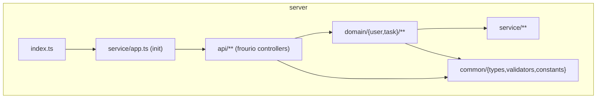

# Code Structure

## Build System
- **Type**: npm モノレポ（ルート / client / server の3つの package.json）。タスク並列実行に `npm-run-all` (run-p/run-s)、ターミナル制御に notios。
- **Configuration**:
  - ルート: lint(eslint/stylelint/prettier)、typecheck、build、test を各パッケージへ委譲。
  - server: `esbuild` でビルド (scripts/build.prod.ts)、`frourio` でルーティング型生成、`prisma` でクライアント生成・マイグレーション。
  - client: `next build`、`aspida`/`pathpida`/`aspida2openapi`/`happy-css-modules` で型・パス・OpenAPI・CSS型を生成。
  - Node: engines `>=24.0.0`（ローカル）、Docker は node:20-alpine。

## Key Modules

## Existing Files Inventory

### server (バックエンド)
- `server/index.ts` — エントリポイント。`init().listen()`。
- `server/service/app.ts` — Fastify 初期化（helmet, etag, cookie, jwt, http-proxy, error handler, frourio server 登録）。
- `server/service/envValues.ts` — zod による環境変数の検証・エクスポート。
- `server/service/cognito.ts` — Cognito クライアントと health/getUser/verifyEmail。
- `server/service/s3Client.ts` — S3 クライアントと keyToUrl/getSignedUrl/health/put/delete。
- `server/service/prismaClient.ts` — Prisma クライアントと retry 付き transaction ヘルパー。
- `server/service/constants.ts` / `customAssert.ts` / `types.ts` — Cookie名/JWTプロパティ名、CustomError、JwtUser 型。
- `server/api/controller.ts` / `index.ts` — ルート API。
- `server/api/health/controller.ts` — ヘルスチェック（DB/S3/Cognito）。
- `server/api/session/controller.ts` — Cookie へのトークン設定 (post) / 削除 (delete)。
- `server/api/private/hooks.ts` — 認証フック（jwtVerify + findOrCreateUser）。
- `server/api/private/me/controller.ts` — ログインユーザー情報取得。
- `server/api/private/me/email/controller.ts` — メール確認 (confirmEmail)。
- `server/api/private/tasks/controller.ts` — タスク get/post/patch/delete。
- `server/api/private/tasks/_taskId@string/controller.ts` — 個別タスク patch/delete。
- `server/api/private/tasks/di/` — DI テスト用ディレクトリ。
- `server/domain/task/taskUseCase.ts` — タスクの create/update/delete（トランザクション）。
- `server/domain/task/model/taskMethod.ts` — TaskEntity 生成・不変条件（作成者チェック）。
- `server/domain/task/model/taskType.ts` — TaskEntity / CreateTaskPayload 型。
- `server/domain/task/store/taskCommand.ts` — upsert/delete + S3 連携。
- `server/domain/task/store/taskQuery.ts` — listByAuthorId/findById（velona DI 付き）。
- `server/domain/task/store/toTaskDto.ts` — Prisma→TaskDto 変換。
- `server/domain/user/userUseCase.ts` — findOrCreateUser / confirmEmail。
- `server/domain/user/model/userMethod.ts` — UserEntity 生成 / updateEmail。
- `server/domain/user/model/userType.ts` — UserEntity 型。
- `server/domain/user/store/userCommand.ts` / `userQuery.ts` / `toUserDto.ts` — 永続化と変換。
- `server/common/types/{user,task,brandedId}.ts` — DTO 型と Branded ID 型。
- `server/common/validators/{task,brandedId}.ts` — zod バリデータ。
- `server/common/constants/index.ts` — APP_NAME, ID_NAMES, IS_PROD。
- `server/prisma/schema.prisma` — User / Task モデル。
- `server/prisma/seed.ts` — シーダー（現状ほぼ空）。
- `server/prisma/migrations/**` — 4つのマイグレーション。
- `server/tests/**` — API テスト（public/private/tasks/di）とセットアップ。

### client (フロントエンド)
- `client/app/layout.tsx` / `page.tsx` — ルートレイアウトとホーム（タスク一覧）。
- `client/app/login/page.tsx` — Amplify Authenticator ログイン画面。
- `client/app/docs/page.tsx` — Swagger UI（OpenAPI 表示）。
- `client/features/auth/AuthLoader.tsx` — 認証イベント購読、Cookie 更新、401 リトライ。
- `client/features/tasks/TaskList.tsx` — タスク一覧/作成/完了切替/削除 UI。
- `client/hooks/useUser.ts` — jotai による user atom。
- `client/hooks/useAlert.tsx` / `useConfirm.tsx` — モーダル系フック。
- `client/layouts/**` — PageLayout, BasicHeader, YourProfile, Content。
- `client/components/**` — Modal, Loading, Btn, icons, Spacer, Portal。
- `client/utils/{apiClient,catchApiErr,envValues}.ts` — aspida クライアント、エラー処理、環境変数。
- `client/common` / `client/api` — server 側 common と生成 API のシンボリックリンク。

## Design Patterns

### 関数型レイヤードアーキテクチャ (UseCase / Model / Store)
- **Location**: `server/domain/{user,task}/`
- **Purpose**: ビジネスロジックを純粋関数中心に分離し、永続化と分ける。
- **Implementation**: UseCase がトランザクション境界、model が Entity 生成と不変条件、store が Query(読み取り)/Command(書き込み)。

### 依存性注入 (velona)
- **Location**: `taskQuery.findManyWithDI`、テスト `tests/api/private/di.test.ts`
- **Purpose**: 全関数を差し替え可能にしテスト容易性を確保。
- **Implementation**: `depend({deps}, fn)` で依存を注入。

### Branded ID（公称型）
- **Location**: `common/types/brandedId.ts`、`common/validators/brandedId.ts`
- **Purpose**: user/task の ID を型レベルで区別し、Entity/Dto/Maybe を使い分け。
- **Implementation**: zod brand + parse。

### HTTP-RPC（RESTではない）+ 型安全クライアント
- **Location**: frourio (`$server`) + aspida (`$api`)
- **Purpose**: フロント/バックを型で接続。
- **Implementation**: controller.ts から型生成、client は `apiClient.private.tasks.$post(...)` で呼ぶ。

### Cookie ベース認証（3rd Party Cookie なし）
- **Location**: `api/session/controller.ts`、`api/private/hooks.ts`
- **Purpose**: HttpOnly Secure SameSite=strict Cookie に idToken/accessToken を保持。
- **Implementation**: fastify-jwt が Cookie からトークンを検証、JWKS で公開鍵取得。

## Critical Dependencies

### frourio / aspida
- **Version**: frourio ^1.3.1 / aspida ^1.14.0
- **Usage**: API ルーティングとクライアントの型生成。
- **Purpose**: 端から端までの型安全な HTTP-RPC。

### Prisma
- **Version**: ^5.22.0
- **Usage**: PostgreSQL ORM、マイグレーション、型生成。
- **Purpose**: データ永続化と型安全クエリ。

### @aws-sdk (cognito-identity-provider / s3 / s3-request-presigner)
- **Version**: ^3.69x
- **Usage**: 認証連携と画像ストレージ。
- **Purpose**: 外部 AWS サービス連携。

### zod
- **Version**: ^3.23.8
- **Usage**: 入力バリデーション、環境変数検証、Branded ID。
- **Purpose**: ランタイム検証と型生成。

### velona
- **Version**: ^0.8.0
- **Usage**: 依存性注入。
- **Purpose**: テスト容易性。
