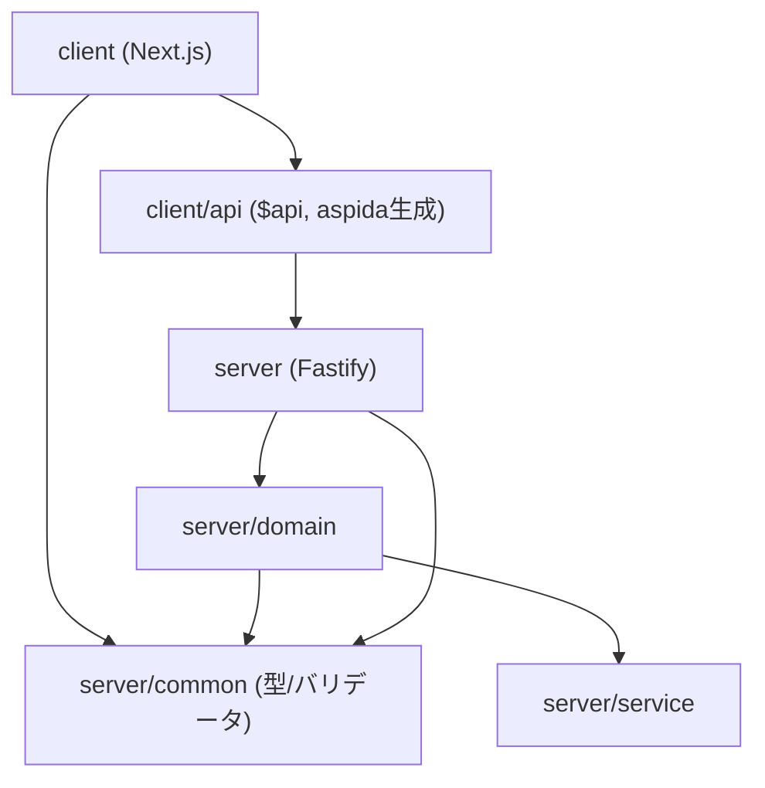

# Dependencies

## Internal Dependencies

### client depends on server/common
- **Type**: Compile（symlink `client/common` → `../server/common`）
- **Reason**: DTO 型・zod バリデータ（例: taskValidator）をフロントでも再利用するため。

### client depends on client/api ($api)
- **Type**: Compile（symlink、aspida 生成物）
- **Reason**: 型安全な API 呼び出し。生成元は server の controller 型。

### server/domain depends on server/service
- **Type**: Runtime
- **Reason**: prisma/cognito/s3 クライアントを利用して永続化・外部連携。

### server/domain depends on server/common
- **Type**: Compile/Runtime
- **Reason**: DTO 型・Branded ID・バリデータ。

## External Dependencies

### frourio / aspida
- **Version**: 1.3.x / 1.14.x
- **Purpose**: 型安全 HTTP-RPC（ルーティング/クライアント生成）。
- **License**: MIT

### fastify (+ @fastify/cookie, etag, helmet, http-proxy, jwt, multipart)
- **Version**: 5.x 系
- **Purpose**: HTTP サーバーとプラグイン群（認証・セキュリティ・プロキシ・ファイルアップロード）。
- **License**: MIT

### @prisma/client / prisma
- **Version**: ^5.22.0
- **Purpose**: PostgreSQL ORM。
- **License**: Apache-2.0

### @aws-sdk/client-cognito-identity-provider / client-s3 / s3-request-presigner
- **Version**: ^3.69x
- **Purpose**: 認証連携、オブジェクトストレージ、署名付きURL。
- **License**: Apache-2.0

### aws-amplify / @aws-amplify/ui-react
- **Version**: ^6.x
- **Purpose**: クライアント認証フローと UI。
- **License**: Apache-2.0

### next / react / react-dom
- **Version**: next ^15.5 / react ^18.3
- **Purpose**: フロントエンドフレームワーク。
- **License**: MIT

### zod
- **Version**: ^3.23.8
- **Purpose**: ランタイムバリデーション。
- **License**: MIT

### velona
- **Version**: ^0.8.0
- **Purpose**: 依存性注入。
- **License**: MIT

### get-jwks / @fastify/jwt
- **Version**: ^9.x
- **Purpose**: Cognito の JWKS 取得と JWT 検証。
- **License**: MIT

### ulid
- **Version**: ^2.3.0
- **Purpose**: 一意な ID 生成（task/user/imageKey）。
- **License**: MIT

### jotai / swr / qrcode / swagger-ui-react
- **Purpose**: 状態管理 / データ取得 / QRコード / OpenAPI 表示。
- **License**: MIT
